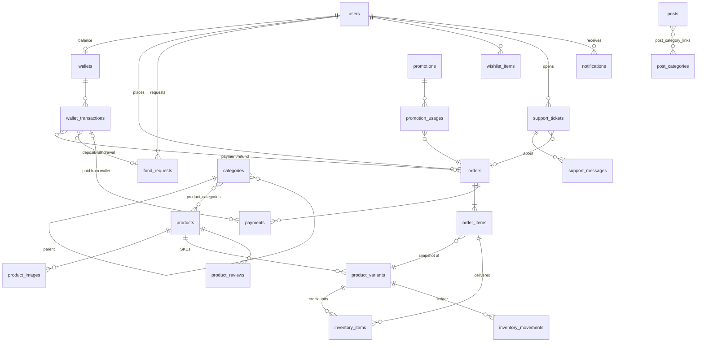

# AIHUB database schema

Designed from the storefront + admin mock data (`src/app/admin/admin-dashboard.tsx`,
`src/types/commerce.ts`, `src/components/wp/product-template.tsx`, checkout drawer, WP sync).
Entities live under `backend/src/<domain>/entities/*.entity.ts`; every table is registered in
`src/database/entities.ts`. Money is stored as `BIGINT` VND (`moneyColumn()`), enums as MySQL `ENUM`.

## Domains → admin modules

| Admin module        | Tables                                                        |
| ------------------- | ------------------------------------------------------------- |
| Đơn hàng            | `orders`, `order_items`, `payments`                           |
| Sản phẩm / Danh mục | `products`, `product_variants`, `product_images`, `categories`, `product_categories` (join), `product_reviews`, `wishlist_items` |
| Kho hàng            | `inventory_items` (từng tài khoản/key), `inventory_movements` (sổ nhập/xuất) |
| Khách hàng          | `users` (role `customer`)                                     |
| Giao dịch           | `wallets`, `wallet_transactions`                              |
| Nạp & rút tiền      | `fund_requests`                                               |
| Khuyến mãi          | `promotions`, `promotion_usages`                              |
| Nội dung            | `content_blocks` (banner/thông báo/trợ giúp), `posts`, `post_categories`, `post_category_links` (join), `pages` |
| Hỗ trợ              | `support_tickets`, `support_messages`                         |
| Báo cáo             | `reports`                                                     |
| Cài đặt             | `settings`                                                    |
| Chuông thông báo    | `notifications`                                               |
| Lịch sử thao tác    | `audit_logs`                                                  |

## ERD

## Key design decisions

- **Variant = package × duration.** The product page shows package buttons (`account_type`:
  "Dùng chung - Plus") and duration buttons (`duration`: "12 tháng"); the chosen pair is one
  `product_variants` row carrying `price` / `regular_price`. Disabled options → `is_enabled = 0`.
- **Stock is per SKU and per unit.** Each sellable account/key is an `inventory_items` row whose
  `status` moves `available → reserved → delivered` (or `revoked`). Admin "Khả dụng / Đang giữ" are
  `COUNT(*)` by status; "Sắp hết" = available `< products.low_stock_threshold`.
  `inventory_movements` is the append-only history behind "Nhập kho".
- **Orders are snapshots.** `order_items` copies product name, variant/duration labels, SKU and
  prices at checkout, so catalog edits never rewrite history. Guest checkout is supported:
  contact fields live on `orders`, `user_id` is optional.
- **Payments vs wallet.** `payments` records each attempt for an order (bank transfer / Zalo /
  wallet). Wallet money only moves through `wallet_transactions` (signed `amount`,
  `balance_after`), which is exactly the admin "Giao dịch" ledger; `fund_requests` are the
  approval queue for "Nạp & rút tiền" and produce a transaction when completed.
- **Public codes** (`orders.code` AH10428, `wallet_transactions.code` GD-722981,
  `fund_requests.code` YC-3912, `support_tickets.code` TK-9201) are separate unique columns so
  ids can stay internal.
- **Denormalised counters** (`products.rating_average/review_count/sold_count`,
  `promotions.usage_count`) keep listing pages cheap; recompute from the source tables on write.
- **WordPress sync compatibility.** `categories`, `products`, `posts`, `post_categories`, `pages`
  keep a unique nullable `wp_id` so `scripts/sync-wp-content.mjs` can upsert instead of duplicating.
- **Soft delete** only on `products` (order history must keep a real row); everything else uses
  `ON DELETE CASCADE` for children and `SET NULL` for audit references.

## Status vocabularies (admin badges)

| Table               | Column            | Values                                                                 |
| ------------------- | ----------------- | ---------------------------------------------------------------------- |
| orders              | status            | pending_payment, processing, completed, cancelled, refunded            |
| orders              | payment_method    | bank_transfer, zalo, wallet                                            |
| payments            | status            | pending, paid, failed, refunded                                        |
| order_items         | delivery_status   | pending, delivered, failed                                             |
| products            | status            | draft, active, hidden                                                  |
| product_variants    | stock_status      | in_stock, out_of_stock, backorder                                      |
| product_variants    | delivery_type     | auto, manual                                                           |
| inventory_items     | status            | available, reserved, delivered, revoked                                |
| inventory_movements | type              | import, reserve, release, deliver, revoke, adjust                      |
| product_reviews     | status            | pending, approved, rejected                                            |
| wallet_transactions | type              | payment, deposit, withdrawal, refund, adjustment                       |
| wallet_transactions | channel           | wallet, bank_transfer, zalo, manual                                    |
| fund_requests       | type / status     | deposit, withdrawal / pending, processing, completed, rejected         |
| promotions          | type              | percent, fixed                                                         |
| promotions          | status            | scheduled, active, paused, ended                                       |
| content_blocks      | type / placement  | banner, announcement, help_article / home, global, help_center, category, product |
| posts, pages, content_blocks | status   | draft, published, archived                                             |
| support_tickets     | priority / status | low, medium, high / new, in_progress, waiting_customer, resolved, closed |
| reports             | format / status   | excel, pdf, dashboard / generating, ready, failed                      |
| settings            | group             | store, payment, roles, notifications, integrations                     |

## Not modelled on purpose

- **Cart** stays client-side (`localStorage`, `ktk.cart.v1`) until checkout creates an order.
- **Customer stats** ("Đơn hàng", "Tổng chi" columns) are aggregates over `orders`; add a cached
  `customer_stats` table later only if the list query becomes slow.
- **Media library / file uploads** – URLs are stored as strings; a `media` table can be added when
  uploads move off WordPress.
